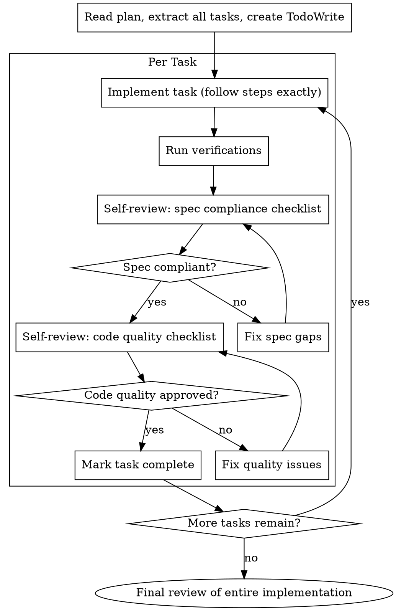

# Complete Plan Execution

## Overview

Load plan, execute all tasks sequentially with two-stage self-review after each, report when complete.

**Announce at start:** "I'm using the complete-plan-execution skill to implement this plan."

## Why This Approach Works

**Why two-stage review?** Spec compliance catches wrong builds (you built the wrong thing). Code quality catches bad builds (you built the right thing poorly). Both matter — spec compliance first because there's no point polishing code that solves the wrong problem.

**Why continuous execution?** The user asked you to execute the plan. Stopping to ask "should I continue?" after each task wastes their time. Trust the plan — execute it. Stop only when genuinely blocked or done.

**Why self-review instead of subagents?** You have full context from implementing the task. Use it — read your own code critically, compare to the spec, catch issues early. You're more efficient than spawning fresh agents who need context loaded.

**Core principle:** One agent, sequential execution, two-stage self-review per task = high quality implementation without context switching

## The Process

### Step 1: Load and Extract Plan

1. Read plan file once
2. Extract ALL tasks with their full text (don't re-read file per task)
3. Note the context and how tasks connect
4. Create TodoWrite with all tasks
5. Review critically - identify any questions or concerns
6. If concerns: Raise with your human partner before starting
7. If no concerns: Proceed to execution

### Step 2: Execute Tasks

For each task:

1. **Mark as in_progress**

2. **Implement** - Follow each step exactly as written

3. **Run verifications** - Execute commands specified in task steps

4. **Self-review: Spec Compliance**
   - Read your own implementation code
   - Compare against task requirements line by line
   - Check: Missing requirements? Extra unrequested work? Misunderstandings?
   - If issues: Fix them, then re-review
   - Do NOT proceed until spec compliance passes

5. **Self-review: Code Quality**
   - Review for: clean code, good names, proper tests, YAGNI
   - Check: Single responsibility per file? Following plan's file structure?
   - If issues: Fix them, then re-review
   - Do NOT proceed until code quality passes

6. **Commit** - Use temp file pattern from core-commands:

   mktemp
   # Returns: /tmp/tmp.XXXXXX
   # Use Write tool to save commit message to temp file
   jj describe --stdin < "/tmp/tmp.XXXXXX"
   rm "/tmp/tmp.XXXXXX"
   jj new

7. **Mark as completed**

### Step 3: Final Review and Complete

After all tasks complete, review entire implementation for coherence

## Self-Review

After implementing each task, perform two-stage self-review. This is where quality happens — don't skip it.

### Implementation Guidance

Before starting each task, review `./implementer-prompt.md` for:
- Code organization principles (one responsibility per file, clear interfaces)
- When to stop and ask for help (architectural decisions, unclear requirements)
- Self-review checklist (completeness, quality, discipline)

### Stage 1: Spec Compliance

Use the checklist in `./spec-review-prompt.md` to verify:
- Everything requested was implemented
- Nothing extra was built
- No misunderstandings

**Critical:** DO NOT trust your own claims about what you built. Read your actual code. Compare it to the task requirements line by line. It's easy to think you implemented something when you actually didn't.

### Stage 2: Code Quality

After spec compliance passes, use `./code-quality-reviewer-prompt.md` to verify:
- Clean, maintainable code
- Good names, proper tests
- YAGNI, single responsibility

**Why this order?** There's no point polishing code that solves the wrong problem. Spec compliance first, then quality.

**Fix issues before committing.** Not "later" — now. Fresh context makes debugging easier.

### Commit After Each Task

Once both reviews pass, commit your work using the temp file pattern from core-commands:

   mktemp
   # Returns: /tmp/tmp.XXXXXX
   # Use Write tool to save commit message to temp file
   jj describe --stdin < "/tmp/tmp.XXXXXX"
   rm "/tmp/tmp.XXXXXX"
   jj new

**Why commit after each task?** Atomic commits make review easier, enable rollback, and document your progress.

## When to Stop and Ask for Help

**STOP executing immediately when:**
- Hit a blocker (missing dependency, test fails, instruction unclear)
- Plan has critical gaps preventing starting
- You don't understand an instruction
- Verification fails repeatedly after genuine attempts to fix
- You've tried multiple approaches and nothing works

**Ask for clarification rather than guessing.**

## When to Revisit Earlier Steps

**Return to plan review when:**
- Partner updates the plan based on your feedback
- Fundamental approach needs rethinking
- You discover the plan has a structural flaw

**Don't force through blockers** - stop and ask.

## Red Flags

**Never:**
- Skip self-reviews (spec compliance AND code quality)
- Skip commits after completing a task
- Proceed with unfixed issues from self-review
- Mark task complete while either review has open issues
- Accept "close enough" on spec compliance
- Skip re-review after fixing issues
- Over-build beyond what was requested
- Add "nice to have" features not in spec

## Remember

- Review plan critically first
- Follow plan steps exactly
- Don't skip verifications
- Reference skills when plan says to
- Stop when blocked, don't guess
- Self-review requires honesty - be critical of your own work
- Fix issues immediately, not "later"
- Two-stage review: spec compliance FIRST, then code quality
- Commit after each task (atomic commits = easier review + rollback)
- Use temp file pattern from core-commands for multi-line content

## Integration

**Required workflow skills:**
- **core-commands** - VCS operations and commit patterns
- **writing-plans** - Creates the plan this skill executes
- **karpathy-guidelines** - Behavioral guidelines for quality implementation